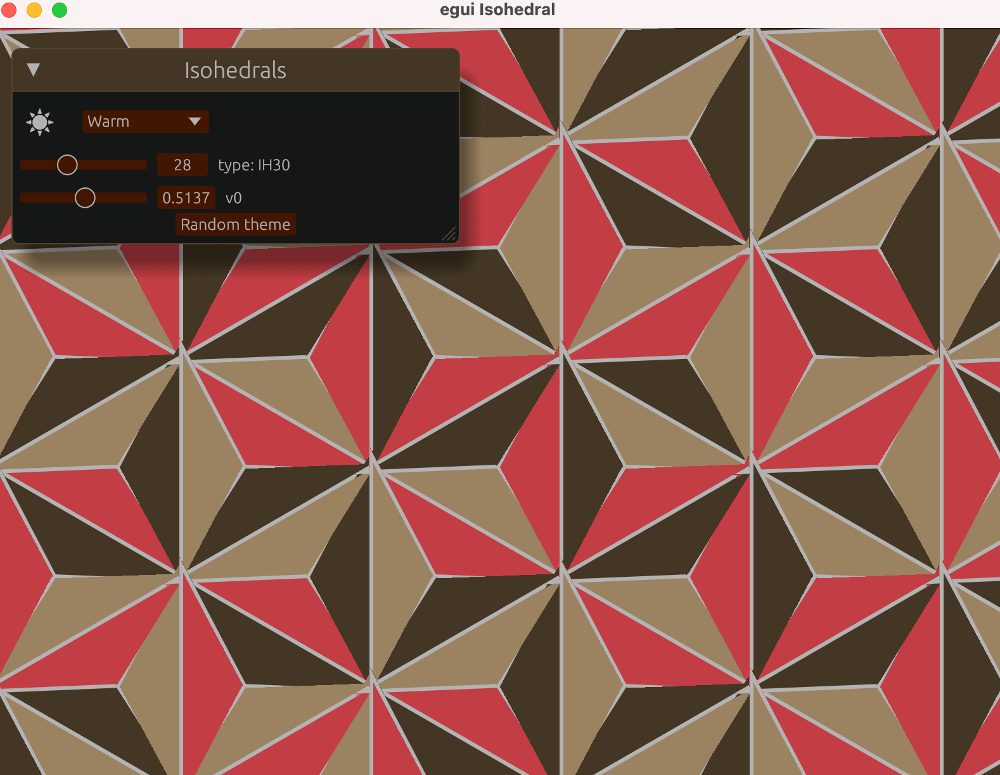

# egui Isohedral

Botched demo of [isohedral](https://isohedral.ca/software/tactile/)
to showcase my crate [egui_colors](https://crates.io/crates/egui_colors).

This is not a library.

Unfortunately egui doesn't draw concave polygons so the implementation is limited. 

## Credit

All credit goes to [Craig S. Kaplan](https://isohedral.ca/about/) for the original code, research, and data.

Much code is derived from the port of [Antoine Bush](https://github.com/abusch/tactile-rs).

All bugs are mine. Any help to get this to a better state is much appreciated.

